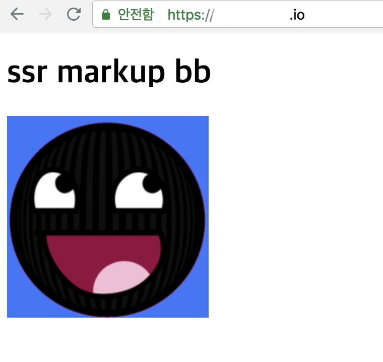

# aws-api-gateway-custom-domain



## Usage

```
$ AWS_DOMAIN=www.example.io serverless create_domain

$ AWS_DOMAIN=www.example.io serverless deploy
```

### Requirements

> | Vendor                    | URL                                                            |
> |---------------------------|----------------------------------------------------------------|
> | serverless-domain-manager | https://github.com/amplify-education/serverless-domain-manager |